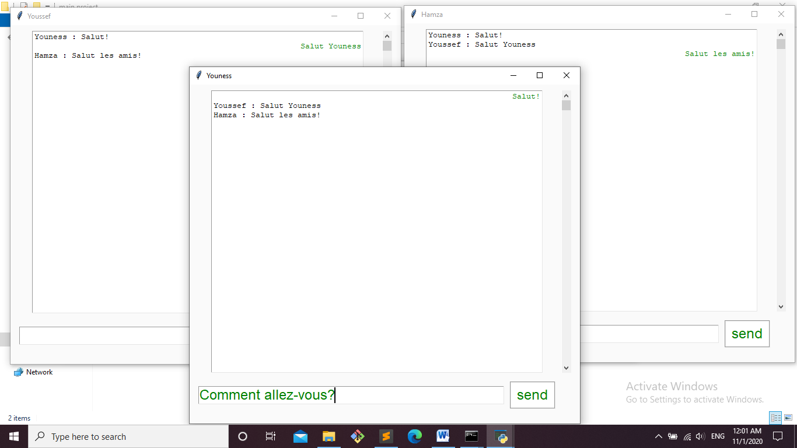

# Chatroom using socket and Tkinter modules in Python

## Created a chatroom in Python that have most of the functionalities that a standard chat room has, from the GUI interface to the real time message exchanging.

Essentially the program uses different modules:
``` python
import socket
import select
import errno
import Thread
import tkinter
```
To launch it you have to run the server.py file, then the client.py script.



Enjoy!
:rocket: